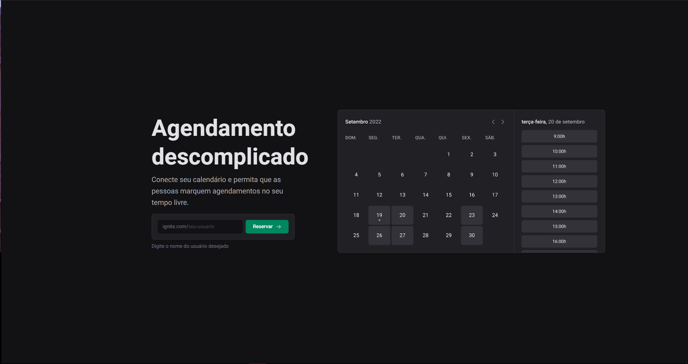
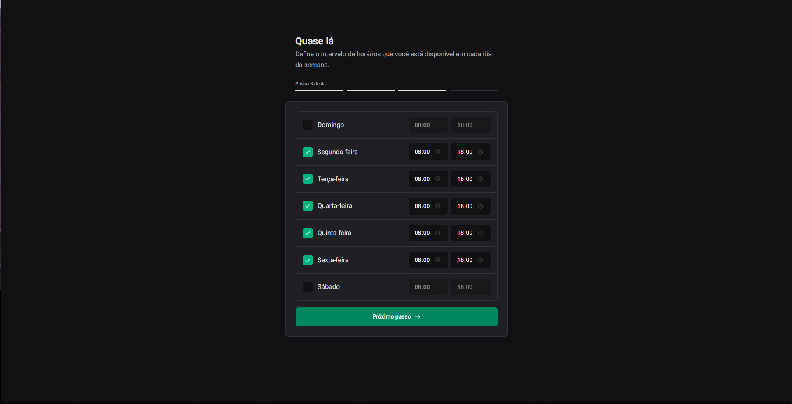
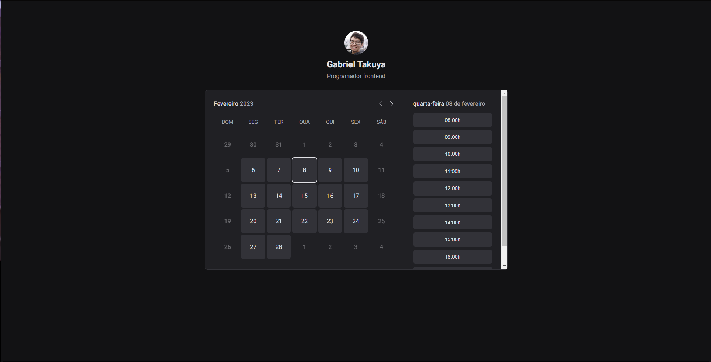

## 📆 Ignite Call

Projeto desenvolvido durante o módulo 06 no curso Ignite da Rocketseat. O projeto permite o usuário criar uma conta utilizando a sua conta Google e realizar agendamentos utlizando a API do Google Calendar.

## 🖼️ Imagens do projeto

## 🛠️ Tecnologias

* Next.js
* Next Auth
* React Query
* React Hook Form
* Zod
* Prisma
* TypeScript

## ☁️ Deploy
[Ignite Call](https://ignite-call-44pa.vercel.app)
